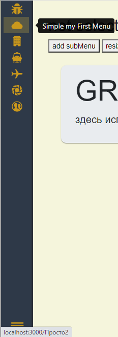

# Динамическое меню
Проект для audio.
Динамическое меню на React, bootstrap5 
####Можно использовать как Tree;

#### как меню;

#### как меню в закрытом состоянии;

Магия, меню работает на основе объекта модели BarData
``````
 class BarData extends Dispatcher{
    constructor() {
        super();
        this.head=new Head();
        /**
         * элементы меню тип: MenuItem
         * @type {*[]}
         */
        this.menuItems=[]
        this._openWidth=300;
        this._currentWidth=300
        /**
         * Ширина меню в закрытом сотоянии
         * @type {number}
         */
        this.closeWidth=100;
        /**
         * Состояние открытости меню
         * @type {boolean}
         */
        this.isOpen=true;
        /**
         * иконка состояния открытости ноды меню ...1- закрыта, ...2- открыта
         * может принимать только React элемент (IconType)
         * @type {JSX.Element}
         */
        this.imageToggleNode1=<BsCaretRight color="#00cc00"/>
        this.imageToggleNode2=<BsCaretDown color="#00cc00"/>

    }

     /**
      * установка ширины открытого меню
      * @param value
      */
    set openWidth(value){
        this._openWidth=value;
        this._currentWidth=value;
    }
    get openWidth(){
        return this._openWidth;
    }

   /**
    * иконка состояния открытости ноды меню ...1- закрыта, ...2- открыта
    * может принимать только React элемент (IconType)
    * @type {JSX.Element}
   */
     this.imageToggleNode1=undefined
     this.imageToggleNode2=undefined
        
     /**
      * Обновление меню снаружи
      */
    forceUpdate(){
        this.dispatch("render",{})
    }
}
``````
Меню может содержать подменю, с неограниченной вложенностью (в пределах разумного)
объект меню содержит поля:
``````
/**
 * Элемент меню
 */
 class MenuItem {
    constructor() {
        /**
         * Идентификатор меню, уникальность по умолчанию uuid,
         * можно назначать от пользователя
         * @type {*}
         */
        this.id=uuidv4();
        /**
         * содержание меню, может быть строкой или react элементом
         * @type {string}
         */
        this.content="mymenu";
        /**
         * управление показом меню
         * @type {boolean}
         */
        this.isShow=true;
        /**
         * Маршрут ссылки меню
         * @type {string}
         */
        this.href="/#";
        /**
         * список субменю {MenuItem}
         * @type {*[]}
         */
        this.menuItems=[];
        /**
         * маркер выбора меню
         * @type {boolean} true выбрано
         * @private
         */
        this._isSelect=false;
        /**
         * маркер управления открыванием субменю
         * @type {boolean}
         * @private
         */
        this._isVisibleSubmenu=false;
        /**
         * размер иконки меню, применяется если иконка из статических фалйов
         * @type {number}
         */
        this.imageSize=30;
        /**
         * url статического файла иконки или React элемент
         * @type {null}
         */
        this.imageSrc=null;
        this.imageMode=null;
        this.imageAlt=".."
        /**
         * Подстказка меню, применяется только при свернутом меню
         * @type {undefined}
         */
        this.tooltip=undefined
        
         /**
         * Выделять меню или не выделять, случай - пользовательский компонент (тип курсора при наведении, поведение при наведении курсора, при клике )
         * например если вы хотите сделать элемент меню, как выпадающий список, или строка ввода
         * @type {boolean}
         */
        this.isSelected=true;

        /**
         * Пользовательские данные
         * @type {undefined}
         */
        this.userData=undefined;
        this.userData1=undefined;
        this.userData2=undefined;
        this.userData3=undefined;
    }
}
``````
запуск - инициализация:
``````
import {BarData, Head, MenuItem} from "./sidebar/WrapperSideBar";

const barData= new BarData()l
..
..
new WrapperSideBar(barData,"root");
``````
подписка на события клика:
`````
barData.on("onclick",(menuitem)=>{
   console.log(menuitem)
    //menuitem.isShow=false; меняем свойство меню
    //barData.forceUpdate(); рефрешим показ
})
`````
установка: 
```
npm install https://github.com/ionson100/sidebarion
```
использование:


